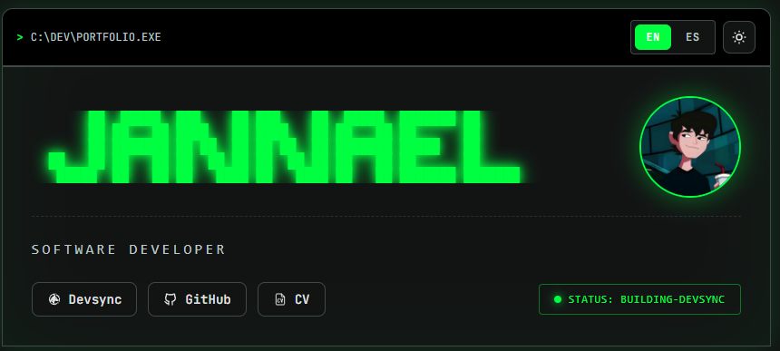

# Asciifolio




Modern portfolio template based on ascii art powered by Devsync

## Quick Start

Initialize your project with a single command:

```bash
bunx @jannael/devsync init
```

## Configuration

Visit [devsync.work](https://devsync.work) to configure your profile and generate your `DEVSYNC.json`.

### Global Fields

This template adds the `department` field as a global field in `DEVSYNC.json`. It appears at the root level (alongside `name`, `img`, `socialMedia`, etc.) and is used across all locales:

```json
{
  "name": "Your Name",
  "department": "R&D / Core Systems",
  "img": "...",
  ...
}
```
